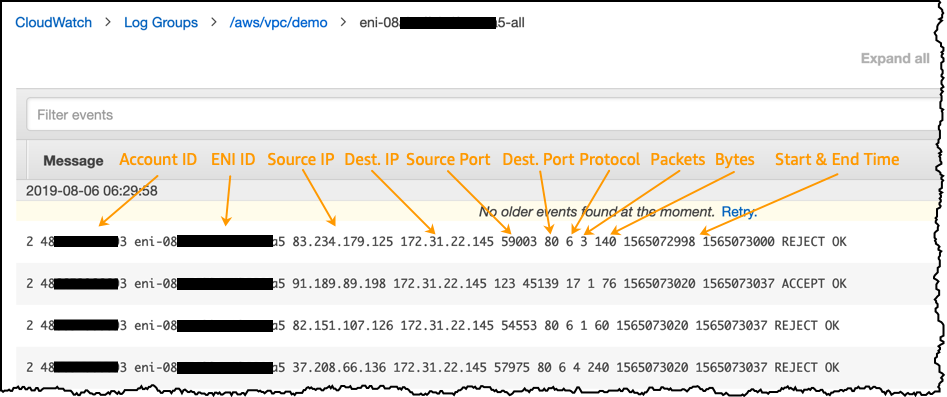

# AWS Security Specialty

## Amazon GuardDuty

- Intelligent Threat discovery to protect you AWS Account
- Uses Machine Learning algorithms, anomaly detection, 3rd party data
- One click to enable (30 days trial), no need to install software
- Input data includes:
  - CloudTrail Events Logs - unusual API calls, unauthorized deployments
    - CloudTrail Management Events - create VPC subnet, create trail, ...
    - CloudTrail S3 Data Events - get object, list objects, delete object, ...
  - VPC Flow Logs - unusual internal traffic, unusual IP addresses
  - DNS Logs - compromised EC2 instances sending encoded data within DNS queries
  - Optional Features - EKS Audit Logs, RDS & Aurora, EBS, Lambda, S3 Data Events ...
- Can setup EventBridge rules to be notified in case of findings
- EventBridge rules can target AWS Lambda or SNS
- Can protect against CryptoCurrency attacks (has a dedicated "finding" for it)

### Amazon GuardDuty - Multi-Account Strategy

- You can manage multiple accounts in GuardDuty
- Associate the Member accounts with the Administrator account
  - Through an AWS Organization
  - Sending invitation through GuardDuty
- Administrator account can:

  - Add and remove member accounts
  - Manage GuardDuty within the associated member accounts
  - Manage findings, suppression rules, trusted IP lists, threat lists

- In an AWS Organization, you can specify a member accounts as the Organization's delegated administrator for GuardDuty
  - This account can manage GuardDuty for all accounts in the organization
  - This account can't be a member account
  - This account can't be the management account of the organization

### Amazon GuardDuty - Findings Automated Response

- Findings are potential security issue for malicious events happening in your AWS account
- Automate response to security issues revealed by GuardDuty Findings using EventBridge
- Send alerts to SNS (email, Lambda, Slack, Chime, ...)

- GuardDuty pulls independent streams of data directly from CloudTrail logs (management events, data events), VPC Flow Logs or EKS logs
- Each finding has a severity value between 0.1 to 8+ (High, Medium, Low)
- Finding naming convention: ThreatPurpose: ResourceTypeAffected/ThreatFamilyName.DetectionMechanism!Artifact

  - ThreatPurpose: Primary purpose of the threat (e.g., Backdoor, CryptoCurrency)
  - ResourceTypeAffected: which AWS resource is the target (e.g., EC2, S3)
  - ThreatFamilyName: describes the potential malicious activity (e.g., NetworkPortUnusual)
  - DetectionMechanism: method GuardDuty detecting the finding (e.g., Tcp, Udp)
  - Artifact: describes a resource that is used in the malicious activity (e.g., DNS)

- You can generate sample findings in GuardDuty to test your automations

### Amazon GuardDuty - Finding Types

- EC2 Finding Types
  - UnauthorizedAccess: EC2/SSHBruteForce, CryptoCurrency: EC2/BitcoinToo.B!DNS
- IAM Finding Types
  - Stealth:IAMUser/CloudTrailLoggingDisabled, Persistence:IAMUser/Policy:EC2FullAccess!DNS, Policy:IAMUser/RootCredentialUsage
- Kubernetes Audit Logs Finding Types
  - CredentialAccess:Kubernetes/MaliciousIPCaller
- Malware Protection Finding Types
  - Execution:EC2/SuspiciousFile, Execution:ECS/SuspiciousFile
- RDS Protection Finding Types
  - CredentialAccess:RDS/AnomalousBehavior.SuccessfulLogin
- S3 Finding Types
  - Policy:S3/AccountBlockPublicAccessDisabled, PenTest:S3/KaliLinux

### Amazon GuardDuty - Trusted and Threat IP Lists

- Works only for public IP addresses
- Trusted IP list
  - List of IP addresses and CIDR ranges that you trust
  - GuardDuty doesn't generate findings for these trusted lists
- Threat IP List

  - List of known malicious IP addresses and CIDR ranges
  - GuardDuty generates findings based on these threat lists
  - Can be supplied by 3rd party threat intelligence or created custom for you

- In a multi-account GuardDuty setup, only the GuardDuty administrator account can manage those lists

### Amazon GuardDuty - Suppression Rules

- Set of criteria that automatically filter and archive new findings
- Example: low-value findings, false-positive findings, or threats you don't intend to act on
- Can suppress entire findings types or define more granular criteria (e.g., suppress only specific EC2 instances)
- Suppressed findings are NOT sent to Security Hub, S3, Detective, or EventBridge
- Suppressed findings can be still viewed in the Archive

Finding type: Recon:EC2/Portscan Instance image ID: ami-999999999 (automatically archive findings when there is a port scan on a specific EC2 instance, e.g., running vulnerability assessment)

Finding type: UnauthorizedAccess:EC2/SSHBruteForce Instance tag value: devops (automatically archive findings when SSH Brute Force attacks are targeting Bastion Hosts EC2 instances)

### Troubleshooting - GuardDuty didn't generate any finding types

- Problem: GuardDuty is activated but it didn't generate any DNS based findings
- Reason: GuardDuty only processes DNS logs if you use the default VPC DNS resolver. All other types of DNS resolvers won't generate DNS based findings.

- If GuardDuty is suspended or disabled, then no finding types are generated
- Best practice to enable GuardDuty even on regions you don't use

---

# AWS Security Hub

- Central security tool to manage security across several AWS accounts and automate security checks
- Integrated dashboards showing current security and compliance status to quickly take actions
- Automatically aggregates alerts in predefined or personal findings formats from various AWS services and AWS partner tools
  - Config
  - GuardDuty
  - Inspector
  - Macie
  - IAM Access Analyzer
  - Firewall Manager
  - Systems Manager
  - Partner Tools
- Must first enable the AWS config service

## Security Hub - Main Features

- Cross-region aggregation: aggregate findings, insights, and security scores from multiple Regions to a single aggregation region
- AWS organizations integration
  - Manage all accounts in the Organization
  - Security hub automatically detects new accounts
  - By default, organization management account is the security hub administrator
  - Ability to have a designated security hub administrator from member accounts
- AWS config must be enabled
  - Security hub uses AWS config to perform its security checks
  - Must be enabled on all accounts (Security Hub does NOT manage AWS config)

## Security Hub - Security Standards

- Security Hub generates findings and continuous checks against the rules in a set of supported security standards
- Security Hub supports the following standards: CIS AWS Foundations, PCI DSS, AWS Foundational Security Best Practices, AWS Security Best Practices, ISO 27001, SOC 2, GDPR, HIPAA, FedRAMP, FISMA, and more

---

# Security Hub - Integration with GuardDuty

- Automatically enabled when Security Hub is enabled (can be disabled)
- GuardDuty will send findings to Security Hub
- Findings are sent in AWS Security Finding Format (ASFF)
- Findings are usually sent within 5 minutes
- Archiving a GuardDuty finding will NOT update the finding in Security Hub

## Security Hub - 3rd Party Integration

- Security Hub integrates with multiple 3rd partner products
- Send findings to Security Hub
  - 3CORESEC
  - ALERT LOGIC
  - AQUA
- Receive Findings from Security Hub
  - ATLASSIAN
  - FIREEYE
  - FORTINET
- Update Findings in Security Hub
  - ATLASSIAN
  - ServiceNow

## Security Hub - Findings

- Security Hub consumes findings using AWS Security Finding Format (ASFF)
- Security Hub automatically updates and deletes findings
- Findings past 90 days are automatically deleted
- Filter by Region, Integration, Security Standard, Inights

## Security Hub - Insights

- Collection of related findings that identifies a security area that requires attention and intervention
- Example: Insight points out EC2 instances that are subject of findings that detect poor security practices
- Brings findings from across finding providers (GuardDuty, Inspector, Macie, IAM Access Analyzer, Firewall Manager, Systems Manager, Partner Tools)
- Each insight defined by a group by statement and optional filters
- Built-In Managed Insights: return results only if you enabled related product integration or security standard (can not edit or delete)
- Custom Insights: create your own insights based on your own criteria
  - example: custom insight to track critical findings affecting member accounts

## Security Hub - Custom Actions

- Helps you automate Security Hub with EventBridge
- Allows you to create actions for response and remediation to selected findings within the Security Hub console
- EventBridge event type is Security Hub Findings - Custom Action

---

# Detective Overview

- GuardDuty, Macie, and Security Hub are used to identify potential security issues, or findings
- Sometimes security findings require deeper analysis to isolate the root cause and take action - it's a complex process
- Amazon Detective analyzes, investigates, and quickly identifies the root cause of security issues or suspicious activities (using ML and graphs)
- Automatically collects and processes events from VPC Flow Logs, CloudTrail, GuardDuty and create a unified view

---

# DDos Simulation Testing on AWS

- Controlled DDoS attack which enables you to evaluate the resiliency of you applications and to practice event response
- Must be performed by an approved AWS DDoS Test Partner
- The target can be either Protected Resources or Edge-Optimized API gateway that is subscribed to Shield Advanced
- Attack must NOT be originated from AWS resources
- Attack must NOT exceed 20G/s
- Attack must NOT exceed 5 million packets per second for CloudFront and 50k packets per second for any other service

---

# Compromised EC2 Instances

- Steps to address compromised instances:

  - Capture the instance's metadata
  - Enable Termination Protection
  - Isolate the instance (replace instances's SG - no outbound traffic authorized)
  - Detach the instance from any ASG (Suspend processes)
  - Deregister the instance from any ELB
  - Snapshot the EBS volumes (deep analysis)
  - Tag the EC2 instance (investigation)

- Offline investigation: shutdown instance
- Online investigation: snapshot memory, capture network traffic
- Automate the isolation process: Lambda
- Automate memory capture: SSM Run command

# Compromised S3 Buckets

- Identify the compromised S3 bucket using GuardDuty
- Identify the source of the malicious activity (e.g. IAM user, role) and the API calls using CloudTrail or Amazon Detective
- Identify whether the source was authorized to make those API calls
- Secure your S3 bucket, recommended settings:
  - S3 block public access settings, S3 bucket policies and user policies, VPC endpoints for S3, S3 pre-signed URLs, S3 access points, S3 ACLs

# Compromised ECS cluster

- Identify the affected ECS cluster using GuardDuty
- Identify the source of the malicious activity (e.g., container image, tasks)
- Isolate the impacted tasks (deny all ingress/egress traffic to the task using security groups)
- Evaluate the presence of malicious activity (e.g., malware)

# Compromised Standalone Container

- identify the malicious container using GuardDuty
- Isolate the malicious container (deny all ingress/egress traffic to the container)
- Suspend all processes in the container (pause the container)
- Or stop the container and look at EBS Snapshots retained by GuardDuty (snapshots retention feature)
- Evaluate the presence of malicious activity (e.g., malware)

# Compromised RDS Database Instance

- Identify the affected DB instance and DB user using GuardDuty
- If it is NOT legitimate behavior:
  - Restrict network access (SGs & NACLs)
  - Restrict the DB access for the suspected DB user
- Rotate the suspected DB user's passwords
- Review DB Audit Logs to identify leaked data
- Secure your RDS DB instance, recommended settings:
  - Use secrets manager to rotate the DB password
  - Use IAM DB Authentication to manage DB users' access without passwords

# Compromised AWS Credentials

- Identify the affected IAM user using GuardDuty
- Rotate the exposed AWS Credentials
- Invalidate temporary credentials by attaching an explicit Deny policy to the affected IAM user with an STS
  date condition (see IAM section)
- Check CloudTrail logs for other unauthorized activity
- Review your AWS resources (e.g., delete unauthorized resources)
- Verify your AWS account information

# Compromised IAM role

- Invalidate temporary credentials by attaching an explicit Deny policy to the affected IAM user with an STS date condition
- Revoke access for the identity to the linked AD if any
- Check CloudTrail logs for other unauthorized activity
- Review your AWS resources (e.g., delete unauthorized resources)
- Verify your AWS account information

# Compromised Account

- Rotate and delete exposed AWS Access Keys
- Rotate and delete any unauthorized IAM user credentials (rotate existing IAM user's passwords)
- Rotate and delete all EC2 key pairs
- Check CloudTrail logs for other unauthorized activity
- Review your AWS resources (e.g., delete unauthorized resources)
- Verify your AWS account information

---

# EC2 serial console

- Use cases: troubleshoot boot, troubleshoot configuration, analyze reboot issues...
- Directly access your EC2 instance's serial port (as if keyboard and monitor are directly attached to the EC2 instance)
- Does NOT require any network capabilities
- Use with supported Nitro-based EC2 instances
- Must setup OS user and password
- Only one active session per EC2 instance
- Disabled by default (enabled at AWS account level)

---

# Connect to Linux EC2 Instance with a lost SSH Key Pair - Using EC2 user data

- Create a new Key Pair, then copy the public key
- Stop the instance, update the EC2 User data (cloud-config format)
- Start the instance and connect with the private key
- Note: This method override the existing public keys
- Delete the EC2 User data

# Connect to Linux EC2 Instance with a lost SSH Key Pair - Using Systems Manager

- Use AWSSupport-ResetAccess Automation Document
- Will create and apply a new key pair (/ec2rl/openssh/instance_id/key)
- Works for both Linux and Windows
- The private key stored encrypted in SSM Parameter Store /ec2rl/openssh/instance_id/key

# Connect to Linux EC2 Instance with a lost SSH Key Pair - Using EC2 Instance Connect

- EC2 Instance Connect agent must be installed (already installed on Amazon Linux 2 and Ubuntu 16.04 or later)
- Connect using EC2 Instance Connect temporary session
- Store permanent new public SSH key into ~/.ssh/authorized_keys

# Connect to Linux EC2 Instance with a lost SSH Key Pair - Using EC2 serial console

- Connect to your instance without a working network connection
- Used with supported Nitro-based instances
- Must be enabled at the AWS account level

# Connect to Linux EC2 Instance with a lost SSH Key Pair - Using EBS Volume Swap

- Create a new key pair
- stop the original EC2 instance
- Detach the EBS root volume
- Attach the EBS volume to a temporary EC2 instance as a secondary volume
- Add the new public key to ~/.ssh/authorized_keys on the volume
- Re-attach the volume to the original instance, then restart the instance

# Connect to Windows EC2 instance with a lost password - Using EC2Launch v2

- Verify EC2Launch v2 service is running (Windows AMIs with the EC2Launch v2 service)
- Detach the EBS root volume
- Attach the volume to a temporary instance as a secondary volume
- Delete file %ProgramData%/Amazon/EC2Launch/state/.run-once
- Re-attach the volume to the original instance, then restart the instance, you will be able to set a new password

# Connect to Windows EC2 instance with a lost password - Using EC2Config

- Verify EC2Config service is running
- Windows AMIs before Windows Server 2016
- Detach the EBS root volume
- Attach the volume to a temporary instance as a secondary volume
- Modify file \ProgramFiles\Amazon\Ec2ConfigService\Settings\Config.xml
- Set EC2SetPassword to Enabled
- Reattach the volume to the original instance, then restart the instance

# Connect to Windows EC2 instance with a lost password - Using EC2Launch

- Windows Server 2016 and later AMIs that doesn't include EC2Launch v2
- Detach the EBS root volume
- Download and install EC2Rescue Tool for Windows Server
- Select Offline instance option -> Diagnose and Rescue -> Reset Administrator password
- Reattach the volume to the original instance, then restart the instance

# Connect to Windows EC2 instance with a lost password - Using Systems Manager

- Must have SSM Agent installed
- Method 1:
  - Use AWSSupport-RunEc2RescueForWindowsTool Run Command Document
  - Install and run EC2Rescue Tool for Windows Server
  - Command is set to ResetAccess
- Method 2:
  - use AWSSupport-ResetAccess Automation Document
  - Works for both Linux and Windows
- Method 3:
  - Manually AWS-RunPowerShellScript Run Command Document
  - Command: net user Administrator Password@123

# EC2Rescue Tool for Linux

- Diagnose and troubleshoot common issues
- Gather syslog logs, diagnose problematic kernel parameters, diagnose common OpenSSH issues, ...
- Supports over 100 modules
- Amazon Linux 2, Ubuntu, RHEL, SUSE Linux
- Install manually or using AWSSupport-TroubleshootSSH Automation Document
  - Installs the tool and tries to fix issues with SSH connections to the instance
- Upload the results directly to AWS Support or an S3 bucket

# Use Cases

- Collect System Utilization Reports
  - vmstate, iostat, mpstat, ...
- Collect Logs and Details
  - syslog, dmesg, application error logs, and SSM logs
- Detect System Problems
  - Asymmetric routing or duplicate root device labels
- Automatically Remediate System Problems
  - Correcting OpenSSH file permissions
  - Disabling known problematic kernel problems
- You can create your own custom module

# EC2Rescue Tool for Windows Server

- Diagnose and troubleshoot common issues
- Collect log files, troubleshoot issues, provide suggestions, ...
- Supports 2 modules (data collector, analyzer)
- Windows Server 2008 R2 or later
- Install manually or using AWSSupport-AWSSupport-RunEC2RescueForWindowsTool Run Command Document
  - Commands: CollectLogs, FixAll, ResetAccess
- Use AWSSupport-ExecuteEC2Rescue Automation Document to troubleshoot connectivity issues
- Upload the results directly to an S3 bucket

# Use Cases

- Instance Connectivity Issues
  - Firewall, RDP, or network interface configuration
- OS Boot Issues
  - Blue screen or stop error, a boot loop, or a corrupted registry
- Gather OS logs and Configuration Files
  - If you need advanced log analysis and troubleshooting
- Common OS issues
  - Disk signature collision, missing drivers, or incorrect registry settings
- ## Perform a restore

---

# AWS Acceptable Use Policy (AUP)

- Governs your use of the services offered by AWS
- You may not use for:
  - Illegal activities
  - Harmful activities
  - Activities that interfere with the services
  - Activities that infringe on the rights of others
  - Activities that may expose AWS to legal liability
- https://aws.amazon.com/aup/

# Abuse Report - AWS

- When you suspect that AWS resources are used for abusive or illegal activities
- You can create an AWS Abuse Report
- Examples: spam, port scanning, DDoS attacks, intrusion attempts, hosting prohibited content, distributing malware, phishing, copyright infringement
- Contact AWS Trust and Safety team with details (e.g., logs, email headers)
- If you receive an email that your AWS resources are used for illegal activity:
  - Respond to the email and explain how you're preventing this
  - If you don't respond within 24 hours, AWS might suspend your AWS account

# IAM Security Tools

- IAM Credentials Report (account-level)
  - A report that lists all your account's users and the status of their various credentials
- IAM Access Advisor (user-level)
  - Access advisor shows the service permissions granted to a user and when those services were last accessed
  - You can use this information to revise your policies

# IM Access Analyzer

- Find out which resources are shared with external entities

  - S3 buckets
  - IAM Roles
  - KMS keys
  - SQS Queues
  - Secrets Manager secrets
  - Lambda functions and Layers

- Define Zone of Trust (trusted accounts) = AWS Account or AWS Organization
- Access outside zone of trusts => findings

- IAM Access Analyzer Policy Validation

  - Validates your policy against IAM policy grammar and best practices
  - General warnings, security warnings, errors, suggestions
  - Provides actionable recommendations

- IAM Access Analyzer Policy Generation
  - Generates IAM policy based on access activity
  - CloudTrail logs is reviewed to generate the policy with the fine-grained permissions and the appropriate Actions and Services
  - Reviews CloudTrail logs for up to 90 days

---

# Amazon Inspector

- Automated Security Assessments
- For EC2 instances
  - Leveraging the AWS System Manager (SSM) agent
  - Analyze against unintended network accessability, vulnerabilities, deviations from best practices
  - Analyze the running OS against known vulnerabilities
- For container Images push to Amazon ECR
  - Assessment of Container Images as they are pushed
- For Lambda Functions

  - Identifies software vulnerabilities in function code and package dependencies
  - Assessment of functions as they are deployed

- Reporting and Integration with AWS Security Hub
- Send findings to Amazon Event Bridge
- Remember: Only for EC2 instances, Container Images and Lambda Functions
- Continuous scanning of the infrastructure, only when needed
- Package vulnerabilities (Ec2, ECR and Lambda) database of CVE
- Network reachability (Ec2) - unintended network accessibility
- A risk score is associated with all vulnerabilities for prioritization

---

# Logging in AWS for security and compliance

- To help compliance requirements, AWS provides many service-specific security and audit logs
- Service Logs include:
  - CloudTrail trails - trace all API calls
  - Config Rules - for config and compliance over time
  - CloudWatch logs - for full data retention
  - VPC Flow Logs - IP traffic within your VPC
  - ELB Access Logs - metadata of requests made to your load balancers
  - CloudFront Logs - web distribution access logs
  - WAF Logs - full logging of all requests analyzed by the service
- Logs can be analyzed using AWS Athena if they're stored in S3
- You should encrypt logs in S3, control access using IAM and Bucket policies, MFA
- Move Logs to Glacier for cost savings on long term storage

- AWS security at scale logging whitepaper (https://d0.awsstatic.com/whitepapers/compliance/AWS_Security_at_Scale_Logging_in_AWS_Whitepaper.pdf)

---

# AWS Systems Manager (SSM) Overview

- Helps you manage your EC2 and On-premises systems at scale
- Get operational insights about the state of your infrastructure
- Easily detect problems
- Patching automation for enhanced compliance
- Works for both Windows and Linux OS
- Integrated with CloudWatch metrics / dashboards
- Integrated with AWS Config
- Free service

# AWS Systems Manager - Features

- Resource Groups
- Operations Management
  - Explorer
  - OpsCenter
  - CloudWatch Dashboard
  - PHD
  - Incident manager
- Shared Resources
  - Documents
- Change Management
  - Change Manager
  - Automation
  - Change Calendar
  - Maintenance Windows
- Application Management
  - Application Manager
  - Application Insights
  - AppConfig
  - Parameter Store
- Node Management
  - Fleet Manager
  - Compliance
  - Inventory
  - Hybrid Activations
  - Session Manager
  - Run Command
  - State Manager
  - Patch Manager
  - Distributor

## How Systems Manager works

- We need to install the SSM agent onto the systems we control
- Installed by default on Amazon Linux 2 AMI and some Ubuntu AMI
- If an instance can't be controlled with SSM, it's probably an issue with the SSM agent or IAM permissions
- Make sure the EC2 instances have proper IAM role to allow SSM actions

# AWS Tags

- You can add text key-value pairs called Tags to many AWS resources
- Commonly used in EC2
- Free naming, common tags are Name, Environment, Team ...
- They're used for
  - Resource grouping
  - Automation
  - Cost allocation
- Better to have too many tags than too few

# Resource Groups

- Create, view or manage logical group of resources thanks to tags
- Allows creation of logical groups of resources such as
  - Applications
  - Different layers of an application stack
  - Production versus development environments
- Regional service
- Works with EC2, S3, DynamoDB, Lambda, etc...

# SSM - Documents

- Documents can be in JSON or YAML
- You define parameters
- You define actions
- Many documents already exist in AWS

# SSM - Run Command

- Execute a document (=script) or just run a command
- Run command across multiple instances (using resource groups)
- Rate Control / Error Control
- Integrated with IAM and CloudTrail
- No need for SSH
- Command output can be shown in the Console, sent to S3 bucket or CloudWatch logs
- Send notifications to SNS about command status (In progress, Success, Failed)
- Can be invoked using EventBridge

# SSM - Automation

- Simplifies common maintenance and deployment tasks of EC2 instances and other AWS resources
- Example: restart instances, create an AMI, EBS snapshot
- Automation Runbook
  - SSM Documents of type Automation
  - Defines actions preformed on your EC2 instances or AWS resources
  - Pre-defined runbooks (AWS) or create custom runbooks
- Can be triggered
  - Manually using AWS Console, AWS CLI or SDK
  - By Amazon EventBridge
  - On a schedule using Maintenance Windows
  - By AWS Config for rules remediation's

# SSM - Parameter Store

- Secure storage for configuration and secrets
- Optional Seamless Encryption using KMS
- Serverless, scalable, durable, easy SDK
- Version tracking of configurations / secrets
- Security through IAM
- Notifications with Amazon EventBridge
- Integration with CloudFormation

## SSM Parameter Store Hierarchy

- /my-department/
  - my-app/
    - dev/
      - db-url
      - db-password
    - prod/
      - db-url
  - other-app/
- /other-department
- /aws/reference/secretsmanager/secret_ID_in_Secrets_Manager
- /aws/service/ami-amazon-linux-latest/amzn2-ami-hvm-x86_64-gp2 (public)

## Standard and advanced parameter tiers

|                                                                 | Standard             | Advanced                               |
| --------------------------------------------------------------- | -------------------- | -------------------------------------- |
| Total number of parameters allowed (per AWS account and Region) | 10,000               | 100,000                                |
| Maximum size of a parameter value                               | 4 KB                 | 8 KB                                   |
| Parameter policies available                                    | No                   | Yes                                    |
| Cost                                                            | No additional charge | Charges apply                          |
| Storage Pricing                                                 | Free                 | $0.05 per advanced parameter per month |

## Parameters Policies (for advanced parameters)

- Allow to assign a TTL to a parameter (expiration date) to force updating or deleting sensitive data such as passwords
- Can assign multiple policies at a time

**Expiration (to delete a parameter)**

```json
{
  "Type": "Expiration",
  "Version": "1.0",
  "Attributes": {
    "Timestamp": "2020-12-02T21:34:33.000Z"
  }
}
```

**ExpirationNotification (EventBridge)**

```json
{
  "Type": "ExpirationNotification",
  "Version": "1.0",
  "Attributes": {
    "Before": "15",
    "Unit": "Days"
  }
}
```

**NoChangeNotification (EventBridge)**

```json
{
  "Type": "NoChangeNotification",
  "Version": "1.0",
  "Attributes": {
    "After": "20",
    "Unit": "Days"
  }
}
```

# SSM - Inventory

- Collect metadata from your managed instances (EC2/On-premises)
- Metadata includes installed software, OS drivers, configurations, installed updates, running services...
- View data in AWS Console or store in S3 and query and analyze using Athena and QuickSight
- Specify metadata collection interval (minutes, hours, days)
- Query data from multiple AWS accounts and regions
- Create Custom Inventory for your custom metadata (e.g., rack location of each managed instance)

## SSM - State Manager

- Automate the process of keeping your managed instances (EC2/On-premises) in a state that you define
- Use cases: bootstrap instances with software, path OS/Software updates on a schedule
- State Manager Association:
  - Defines the state that you want to maintain to your managed instances
  - Example: port 22 must be closed, antivirus must be installed...
  - Specify a schedule when this configuration is applied
- Uses SSM Documents to create an Association (e.g., SSM Document to configure CW Agent)

## SSM - Patch Manager

- Automates the process of patching managed instances
- OS updates, applications updates, security updates,...
- Supports both EC2 instances and on-premises servers
- Supports Linux, MacOS, and Windows
- Patch on-demand or on a schedule using Maintenance Windows
- Scan instances and generate patch compliance report (missing patches)
- Patch compliance report can be sent to S3

- Patch Baseline
  - Defines which patches should and shouldn't be installed on your instances
  - Ability to create custom Patch Baselines (specify approved/rejected patches)
  - Patches can be auto-approved within days of their release
  - By default, install only critical patches and patches related to security
- Patch Group
  - Associate a set of instances with a specific Patch Baseline
  - Example: create Patch Groups for different environments (dev, test, prod)
  - Instances should be defined with the tag key Patch Group
  - An instance can only be in one Patch Group
  - Patch Group can be registered with only one Patch Baseline

# SSM - Patch Manager Patch Baselines

- Pre-Defined Patch Baseline
  - Managed by AWS for different Operating Systems (can't be modified)
  - AWS-RunPatchBaseline (SSM Document) - apply both operating system and application patches (Linux, macOS, Windows Server)
- Custom Patch Baseline
  - Create your own Patch Baseline and choose which patches to auto-approve
  - Operating System, allowed patches, rejected patches, ...
  - Ability to specify custom and alternative patch repositories

# SSM - Maintenance Windows

- Defines a schedule for when to perform actions on your instances
- Example: OS patching, updating drivers, installing software, ...
- Maintenance Windows contains
  - Schedule
  - Duration
  - Set of registered instances
  - Set of registered tasks

# SSM - Session Manager

- Allows you to start a secure shell on your EC2 and on-premises servers
- Access through AWS Console, AWS CLI, or Session Manager SDK
- Does not need SSH access, bastion hosts, or SSH keys
- Supports Linux, macOS, and Windows
- Log connections to your instances and executed commands
- Session log data can be sent to S3 or CloudWatch Logs
- CloudTrail can intercept StartSession events
- IAM Permissions
  - Control which users/groups can access Session Manager and which instances
  - Use tags to restrict access to only specific EC2 instances
- Optionally, you can restrict commands a user can run in a session

# Unified CloudWatch Agent

- For virtual servers (EC2 instances, on-premises servers, ...)
- Collect additional system-level metrics such as RAM, processes, used disk space, etc.
- Collect logs to send to CloudWatch Logs
  - No logs from inside your EC2 instance will be sent to CloudWatch Logs without using an agent
- Centralized configuration using SSM Parameter Store
- Make sure IAM permissions are correct
- Default namespace for metrics collected by the Unified CloudWatch agent is CWAgent (can be configured/changed)

# Unified CloudWatch Agent - procstat Plugin

- Collect metrics and monitor system utilization of individual processes
- Supports both Linux and Windows servers
- Example: amount of time the process uses CPU, amount of memory the process uses, ...
- Select which processes to monitor by
  - pid_file: name of process identification number (PID) files they create
  - exe: process name that match string you specify (RegEx)
  - pattern: command lines used to start the processes (RegEx)
- Metrics collected by procstat begins with "procstat" prefix (e.g., procstat_cpu_time, procstat_cpu_usage, ...)

# Unified CloudWatch Agent - Troubleshooting

- CloudWatch Agent Fails to Start
  - Might be an issue with the configuration file
  - Check configuration file logs at /opt/aws/amazon-cloudwatch-agent/logs/configuration-validation.log
- Can't Find Metrics Collected by the CloudWatch Agent
  - Check you're using the correct namespace (default: CWAgent)
  - Check the configuration file amazon-cloudwatch-agent.json

```json
"agent": {
 "metrics_collection_interval": 60,
 "region": "us-east-1",
 "logfile": "/opt/aws/amazon-cloudwatch-agent/logs/amazon-cloudwatch-agent.log",
 "debug": true,
 "run_as_user": "cwagent"
}
```

- CloudWatch Agent Not pushing log events

  - Update to the latest CloudWatch Agent version
  - Test connectivity to the CloudWatch logs endpoint
    "logs.<region>.amazonaws.com" (check SGs, NACLs, VPC endpoints)
  - Review account, region, and log group configurations
  - Check IAM Permissions
  - Verify the system time on the instance is correctly configured

- Check CloudWatch Agent logs at /opt/aws/amazon-cloudwatch-agent/logs/amazon-cloudwatch-agent.log

# CloudWatch Logs

- Log groups: arbitrary name, usually representing an application
- Log stream: instances within application / log files / containers
- Can define log expiration policies (never expire, 1 day to 10 years)
- CloudWatch Logs can send logs to:
  - Amazon S3 (exports)
  - Kinesis Data Streams
  - Kinesis Data Firehose
  - AWS Lambda
  - OpenSearch Service (formerly Elasticsearch Service)
- Logs are encrypted by default
- Can setup KMS-based encryption with your own keys

# CloudWatch Logs - Sources

- SDK, CloudWatch Logs Agent, CloudWatch Unified Agent
- Elastic Beanstalk: collection of logs from application
- ECS: collection of logs from containers
- Lambda: collection of logs from functions
- VPC Flow Logs: collection of logs from VPC
- CloudTrail: collection of logs from API calls
- Route 53: collection of logs from DNS queries
- Amazon API Gateway: collection of logs from API calls

# CloudWatch Logs Insights

- Search and analyze log data stored in CloudWatch Logs
- Example: find a specific IP inside a log, count occurrences of "ERROR" in your logs..
- Provides a purpose-built query language
  - Automatically discovers fields from AWS services and JSON log events
  - Fetch desired event fields, filter based on conditions, calculate aggregate statistics, sort events, limit number of events...
  - Can save queries and add them to CloudWatch Dashboards
- Can query multiple Log Groups in different AWS accounts
- It's a query engine, not a real-time engine

# CloudWatch Logs - S3 Export

- Log data can take up to 12 hours to become available for export
- The API call is CreateExportTask
- Not near-real time or real-time...use Logs Subscriptions instead

# CloudWatch Logs Subscriptions

- Get a real-time log events from CloudWatch Logs for processing and analysis
- Send to Kinesis Data Streams, Kinesis Data Firehose, or Lambda

# CloudWatch Alarms

- Alarms are used to trigger notifications for any metric
- Various options (sampling, %, max, min, etc...)
- Alarm States:
  - OK: metric is within the defined threshold
  - ALARM: metric is outside the defined threshold
  - INSUFFICIENT_DATA: not enough data to determine the state of the alarm
- Period:
  - Length of time in seconds to evaluate the metric
  - High resolution custom metrics: 10 sec, 30 sec or multiples of 60 sec

# CloudWatch Alarm Targets

- Stop, Terminate, Reboot, or Recover an EC2 instance
- Trigger Auto Scaling Action
- Send notification to SNS (from which you can send email, SMS, Lambda, HTTP/S, SQS, Step Functions, Chime, Slack, ...)

# CloudWatch Alarms - Composite Alarms

- CloudWatch Alarms are on a single metric
- Composite Alarms are monitoring the states of multiple other alarms
- AND and OR conditions
- Helpful to reduce "alarm noise" by creating complex composite alarms

# EC2 Instance Recovery

- Status Check:
  - Instance status = check the EC2 VM
  - System status = check the underlying hardware
  - Attached EBS status = check attached EBS volumes
- Recovery: Same Private, Public, Elastic IP, metadata, placement group

# CloudWatch Alarm: good to know

- Alarms can be created based on CloudWatch Logs Metrics Filters
- To test alarms and notifications, set the alarm state to Alarm using CLI
  ```bash
  aws cloudwatch set-alarm-state --alarm-name MyAlarm --state-value ALARM --state-reason "Testing alarm state"
  ```

# CloudWatch - Contributed Insights (Metrics)

- Analyze log data and create time series that display contributor data
- Helps you find top talkers and understand who/what is impacting system performance
- Example: find bad hosts, identify the heaviest network users, find the URLs that generate the most errors
- Works for any AWS-generated logs (VPC, DNS, etc...)
- Built-in rules created by AWS (leverages your CW Logs) or build your own rules

# Amazon EventBridge (formerly CloudWatch Events)

- Schedule: Cron jobs (scheduled scripts)
- Event Pattern: Event rules to react to a service doing something
- Trigger Lambda functions, send SQS/SNS messages...

- Event buses can be accessed by other AWS accounts using Resource-based Policies
- You can archive events (all/filter) sent to an event bus (indefinitely or set period)

# Amazon EventBridge - Schema Registry

- EventBridge can analyze the events in your bus and infer the schema
- The Schema Registry allows you to generate code for your application, that will know in advance how data is structured in the event bus

# Amazon EventBridge - Resource based Policy

- Manage permissions for a specific Event Bus
- Example: allow/deny events from another AWS account or AWS region
- Use case: aggregate all events from your AWS Organization in a single AWS account or AWS region

# Amazon Athena

- Serverless query service to analyze data stored in Amazon S3
- Uses standard SQL language to query the files (built on Presto)
- Supports CSV, JSON, ORC, Avro, and Parquet
- Commonly used with Amazon Quicksight for reporting/dashboards
- Use cases: Business intelligence / analytics / reporting, analyze and query VPC Flow Logs, ELB Logs, CloudTrail trails, etc...
- Exam Tip: Analyze data in S3 using serverless SQL, use Athena

# Amazon Athena - Performance Improvement

- Use columnar data for cost-savings (less scan)
  - Apache Parquet or ORC is recommended
  - Huge performance improvement
  - Use Glue to convert your data to Parquet or ORC
- Compress data for smaller retrievals (bzip2, gzip, lz4, snappy, zlip, zstd...)
- Partition datasets in S3 for easy querying on virtual columns
  - s3://yourBucket/pathToTable/<PARTITION_COLUMN_NAME>=<VALUE>...
  - Example: s3://athena-examples/flight/parquet/year=1991/month-1/day=1/
- Use larger files (> 128 MB) to minimize overhead

# Amazon Athena - Federated Query

- Allows you to run SQL queries across data stored in relational, non-relational, object, and custom data sources (AWS or on-premises)
- Uses Data Source Connectors that run on AWS Lambda to run Federated Queries (e.g., CloudWatch Logs, DynamoDB, RDS,...)
- Store the results back in Amazon S3

# Amazon Athena - Troubleshooting

- Insufficient Permissions When using Athena with QuickSight
  - Validate QuickSight can access S3 buckets used by Athena
  - If the data in the S3 buckets is encrypted using AWS KMS key (SSE-KMS), then QuickSight IAM role must be granted access to decrypt with the key (kms:Decrypt)
    - arn:aws:iam::<account_id>:role/service-role/aws-quicksight-s3-consumers-role-v0 (Default)
    - arn:aws:iam::<account_id>:role/service-role/aws-quicksight-service-role-v0

# AWS CloudTrail

- Provides governance, compliance and audit for your AWS account
- CloudTrail is enabled by default
- Get a history of events / API calls made within your AWS Account by:

  - AWS Management Console
  - AWS SDKs
  - Command Line Tools
  - Other AWS Services

- Can put logs from CloudTrail into CloudWatch Logs or S3
- A trail can be applied to All Regions (default) or a single Region
- If a resource is deleted in AWS, investigate CloudTrail first

# CloudTrail Events

- Management Events:
  - Operations that are performed on resources in your AWS account
  - Examples:
    - Configuring security (IAM AttachRolePolicy)
    - Configuring rules for routing data (Amazon EC2 CreateSubnet)
    - Setting up logging (AWS CloudTrail CreateTrail)
  - By default, trails are configured to log management events
  - Can separate Read Events (that don't modify resources) from Write Events (that may modify resources)
- Data Events:
  - By default, data events are not logged (because high volume operations)
  - Amazon S3 object-level activity (ex: GetObject, DeleteObject, PutObject): can separate Read and Write Events
  - AWS Lambda function execution activity (the Invoke API)

# CloudTrail Insights

- Enable CloudTrail Insights to detect unusual activity in your account:
  - inaccurate resource provisioning
  - hitting service limits
  - Bursts of AWS IAM actions
  - Gaps in periodic maintenance activity
- CloudTrail Insights analyzes normal management events to create a baseline
- Then continuously analyzes write events to detect unusual patters
  - Anomalies appear in the CloudTrail console
  - Event is sent to Amazon S3
  - An EventBridge event is generated (for automation needs)

# CloudTrail Events Retention

- Events are stored for 90 days in CloudTrail
- To keep events beyond this period, log them to S3 and use Athena

# CloudTrail - Log File Integrity Validation

- Digest Files:
  - References the log files for the last hour and contains a hash of each
  - Stored in the same S3 bucket as log files (different folder)
- Helps you determine whether a log file was modified/deleted after CloudTrail delivered it
- Hashing using SHA-256, Digital Signing using SHA-256 with RSA
- Protect the S3 bucket using bucket policy, versioning, MFA Delete protection, encryption, object lock
- Protect CloudTrail using IAM

# CloudTrail - Integration with EventBridge

- Used to react to any API call being made in your account
- CloudTrail is not "real-time":
  - Delivers an event within 15 minutes of an API call
  - Delivers log files to an S3 bucket every 5 minutes

# CloudTrail - Organizations Trails

- A trail that will log all events for all AWS accounts in an AWS Organization
- Log events for management and member accounts
- Trail with the same name will be created in every AWS account (IAM permissions)
- Member accounts can't remove or modify the organization trail (view only)

# CloudTrail - Integration with Athena

- You can use Athena to directly query CloudTrail Logs stored in S3
- Example: analyze operational activity for security and compliance
- Can create Athena table directly from the CloudTrail Console, then specify the S3 bucket location where the CloudTrail logs are stored

# Monitor Account Activity

- AWS Config Configuration History
  - Must have AWS Config Configuration Recorder on
- CloudTrail Event History
  - Search API history for past 90 days
  - Filter by resource name, resource type, event name, ...
  - Filter by IAM user, assumed IAM role session name, or AWS Access Key
- CloudWatch Logs Insights
  - Search API history beyond the past 90 days
  - CloudTrail Trail must be configured to send logs to CloudWatch Logs
- Athena Queries
  - Search API history beyond the past 90 days

# Amazon Macie

- Amazon Macie is a fully managed data security and data privacy service that uses machine learning and pattern matching to discover and protect your sensitive data in AWS.
- Macie helps identify and alert you to sensitive data, such as personally identifiable information (PII)

# AWS Macie - Data Identifiers

- Used to analyze and identify sensitive data in your S3 buckets
- Managed Data Identifier
  - A set of built-in criteria that are designed to detect specific type of sensitive data
  - Examples: credit card numbers, AWS Credentials, bank accounts
- Custom Data Identifier
  - A set of criteria that you define to detect sensitive data
  - Regular expression, keywords, proximity rule
  - Examples: employee IDs, customer account numbers

# AWS Macie - Findings

- A report of a potential issue or sensitive data that Macie found
- Each finding has a severity rating, affected resource, datetime, ...
- Sensitive Data Discovery Result
  - A record that logs details about the analysis of an S3 object
  - Configure Macie to store the results in S3, then query using Athena
- Suppression Rules - set of attribute-based filter criteria to archive findings automatically
- Findings are stored for 90 days
- Review findings using AWS console, EventBridge, Security Hub

# AWS Macie - Finding Types

- Policy Findings
  - A detailed report of policy violation or issue with the security of S3 bucket
  - Examples: default encryption is disabled, bucket is public,...
  - Policy: IAMUser/S3BucketEncryptionDisabled, Policy:IAMUser/S3BucketPublic
  - Detect changes only after you enable Macie
- Sensitive Data Findings
  - A detailed report of sensitive data that's found in S3 buckets
  - Examples: Credentials (private keys), Financial (credit card numbers),...
  - SensitiveData:S3Object/Credentials, SensitiveData:S3Object/Financial
  - For Custom Data Identifier SensitiveData:S3Object/CustomIdentifier

# AWS Macie - Multi-Account Strategy

- You can manage multiple accounts in Macie
- Associate the Member accounts with the Administrator account
  - Through an AWS Organization
  - Sending invitation through Macie
  - Supports Delegated Administrator in an AWS Organization
- Administrator account can:
  - Add and remove member accounts
  - Have access to all S3 sensitive data and settings for all accounts
  - Manage Automated Sensitive Data Discovery and run Data Discovery jobs
  - Manage Data Identifiers and Findings

# S3 Event Notifications

- S3:ObjectCreated, S3:ObjectRemoved, S3:ObjectRestore, S3:Replication...
- Object name filtering possible (\*.jpg)
- Use case: generate thumbnails of images uploaded to S3
- Can create as many "S3 events" as desired
- S3 event notifications typically deliver events in seconds but can sometimes take a minute or longer

# S3 Event Notifications with Amazon EventBridge

- Advanced filtering options with JSON rules (metadata, object size, name...)
- Multiple Destinations - ex Step Functions, Kinesis Streams / Firehose ...
- EventBridge Capabilities - Archive, Replay Events, Reliable delivery

# VPC Flow Logs

- Capture information about IP traffic going into your interfaces:
  - VPC Flow Logs
  - Subnet Flow Logs
  - Elastic Network Interface (ENI) Flow Logs
- Helps to monitor and troubleshoot connectivity issues
- Flow logs data can go to S3, CloudWatch Logs, and Kinesis Data Firehose
- Captures network information from AWS managed interfaces too: ELB, RDS, ElasticCache, Redshift, WorkSpaces, NATGW, Transit Gateway...

# VPC Flow Logs Syntax



- srcaddr and dstaddr -- help identify problematic IP
- srcport and dstport -- help identify problematic ports
- Action - success or failure of the request due to Security Group or NACL
- Can be used for analytics on usage patterns, or malicious behavior
- Query VPC flow logs using Athena on S3 or CloudWatch Logs Insights

# VPC Flow Logs - Traffic not captured

- Traffic to Amazon DNS server (custom DNS server traffic is logged)
- Traffic for Amazon Windows license activation
- Traffic to and from 169.254.169.254 for EC2 instance metadata
- Traffic to and from 169.254.169.123 for Amazon Time Sync service
- DHCP traffic
- Mirrored traffic
- Traffic to the VPC router reserved IP address (e.g., 10.0.0.1)
- Traffic between VPC Endpoint ENI and Network Load Balancer ENI

# VPC - Traffic Mirroring

- Allows you to capture and inspect network traffic in your VPC
- Route the traffic to security appliances that you manage
- Capture the traffic
  - From (Source) - ENIs
  - To (Targets) - an ENI or a Network Load Balancer
- Capture all packets or capture the packets of your interest (optionally, truncate packets)
- Source and Target can be in the same VPC or different VPCs (VPC Peering)
- Use cases: content inspection, threat monitoring, troubleshooting,...

# VPC Network Access Analyzer

- Helps you understand potential network paths to/from your resources
- Define Network Access Requirements
  - Example: identify publicly available resources
- Evaluate against them and find issues / demonstrate compliance
  - Evaluate network access to resources in your VPCs (Ec2, RDS, Aurora, OpenSearch, Redshift, ElastiCache, Lambda, ECS, EKS, ...)
  - Match against the configurations of your VPC resources (SG, NACL, NATGW, IGW...)
- Network Access Scope - json document contains conditions to define your network security policy (e.g. detect public databases)

# Route 53 -- DNS Query Logging

- Log information about public DNS queries Route 53 Resolver receives
- Only for Public Hosted Zones
- Logs are sent to CloudWatch Logs only

# Route 53 -- Resolver Query Logging

- Logs all DNS queries...
  - Made by resources within a VPC (EC2, Lambda, etc...)
  - From on-premises resources that are using Resolver Inbound Endpoints
  - Leveraging Resolvers Outbound Endpoints
  - Using Resolver DNS Firewall
- Can send logs to CloudWatch Logs, S3 bucket, or Kinesis Data Firehose
- Configurations can be shared with other AWS Accounts using AWS Resource Access Manager (RAM)

# Amazon OpenSearch Service

- Amazon OpenSearch is successor to Amazon Elasticsearch Service
- In DynamoDB, queries only exist by primary key or indexes...
- With OpenSearch, you can search any field, even partially matches
- It's common to use OpenSearch as a complement to another database
- Two modes: managed cluster or serverless cluster
- Does not natively support SQL (can be enabled via a plugin)
- Ingestion from Kinesis Data Firehose, AWS IoT, and CloudWatch Logs
- Security through Cognito and IAM, KMS encryption, TLS
- Comes with OpenSearch Dashboards (visualization)

# OpenSearch - Public Access

- Accessible from the Internet with a public endpoint
- Restrict access using Access Policies, Identity-based Policies, and IP-based Policies

# OpenSearch - VPC Access

- Specify VPC, Subnets, Security Groups, and IAM Role
- VPC Endpoints and ENIs will be created (IAM Role)
- You need to use VPN, Transit Gateway, managed network, or proxy server to connect to the domain
- Restrict access using Access Policies and Identity-base Policies

# Bastion Hosts

- We can use a Bastion Host to SSH into our private EC2 instances
- The bastion is in the public subnet which is then connected to all other private subnets
- Bastion Host security group must allow inbound from the internet on port 22 from restricted CIDR, for example the public CIDR of your corporation
- Security Group of the EC2 instances must allow the security group of the bastion host, or the private IP of the bastion host

# AWS Site-to-Site VPN

- Virtual Private Gateway (VGW)
  - VPN concentrator on the AWS side of the VPN connection
  - VGW is created and attached to the VPC from which you want to create the Site-to-Site VPN connection
  - Possibility to customize the ASN (Autonomous System Number) of the VGW
- Customer Gateway (CGW)
  - Physical device or software application on your side of the VPN connection
  - CGW is created and configured with the public IP address of your customer gateway device
  - Possibility to customize the ASN (Autonomous System Number) of the CGW

# Site-to-Site VPN Connections

- Customer Gateway Device (on-premises)
  - What IP address to use?
    - Public Internet-routable IP address for your Customer Gateway device
    - If it's behind a NAT device that's enabled for NAT traversal (NAT-T), use the public IP address of the NAT device
    - Important step: enable Route Propagation for the Virtual Private Gateway in the route table that is associated with your subnets
    - If you need to ping your EC2 instances from on-premises, make sure you add the ICMP protocol on the inbound of your security groups

# AWS VPN CloudHub

- Provides secure communication between multiple sites, if you have multiple VPN connections
- Low-cost hub-and-spoke model for primary or secondary network connectivity between different locations (VPN only)
- It's a VPN connection so it goes over the public internet
- To set it up, connect multiple VPN connections on the same VGW, setup dynamic routing and configure route tables

# AWS Client VPN

- Connect from your computer using OpenVPN to your private network in AWS and on-premises
- Allow you to connect to your EC2 instances over a private IP (just as if you were in the private VPC network)
- Goes over public internet

# ClientVPN - Authentication Types

- Active Directory Authentication
  - Authenticate against Microsoft Active Directory (User-Based)
  - AWS Managed Microsoft AD or on-premises AD through AD Connector
  - Supports MFA
- Mutual Authentication
  - Authenticate using client certificates (Device-Based)
  - Client certificate must be signed by a trusted CA
  - Must upload the server certificate to AWS Certificate Manager (ACM)
  - One client certificate per user (recommended)
- Single Sign-On (supports IAM identity Center / AWS SSO)
  - Authenticate against SAML 2.0-based identity providers (User-based)
  - Establish trust relationship between AWS and the identity provider
  - Only one identity provider at a time

# VPC Peering

- Privately connect two VPCs using AWS network
- Make them behave as if they were in the same network
- Must not have overlapping CIDRs
- VPC Peering connection is NOT transitive (must be established for each VPC that needs to communicate with one another)
- You must update route tables in each VPC's subnets to ensure EC2 instances can communicate with each other
- You can create VPC Peering connection between VPCs in different AWS accounts/regions
- You can reference a security group in a peered VPC (works cross accounts - same region)
